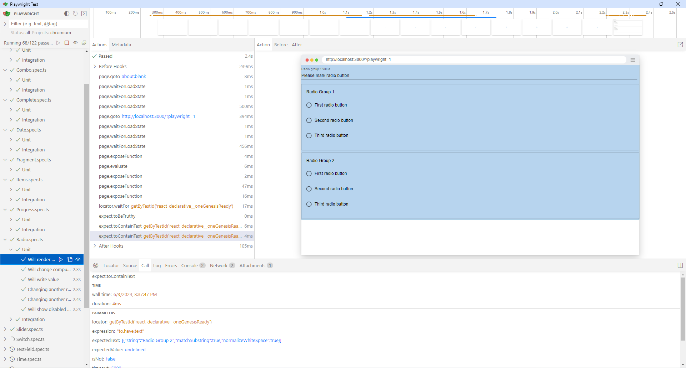

# react-declarative-e2e

> Playwright end-to-end testbed for [react-declarative](https://github.com/react-declarative/react-declarative)



## Contribute

> [!IMPORTANT]
> Made especially for newbies as an advanced documentation for `react-declarative` to solve your problems. **⭐Star** and **💻Fork** It [on github](https://github.com/react-declarative/react-declarative) will be appreciated

## Usage

1. Build the project

```bash
npm run build
```

2. Run tests

```bash
npm run test:ui
```

or

```bash
npm run test
```
