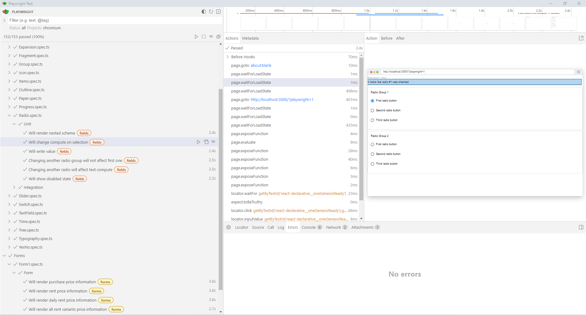

# ⚛️ react-declarative-e2e

> Playwright end-to-end testbed for [react-declarative](https://github.com/react-declarative/react-declarative)



## Purpose

This will help you to tweak `react-declarative` with your own UI Kit. Check this [article for guide](https://github.com/react-declarative/react-declarative/blob/master/docs/other/how-to-implement-uikit.md)

## Contribute

> [!IMPORTANT]
> Made especially for newbies as an advanced documentation for `react-declarative` to solve their problems. **⭐Star** and **💻Fork** It [on github](https://github.com/react-declarative/react-declarative) will be appreciated

## Usage

1. Build the project

```bash
npm run build
```

2. Run tests

```bash
npm run test:ui
```

or

```bash
npm run test
```


## Test Cases

<!--
```
const fieldMap = {
    'date-field': FieldType.Date,
    'time-field': FieldType.Time,
    'component-field': FieldType.Component,
    'slider-field': FieldType.Slider,
    'choose-field': FieldType.Choose,
    'dict-field': FieldType.Dict,
    'complete-field': FieldType.Complete,
    'fragment-layout': FieldType.Fragment,
}
```
-->

1. [TypographyField](./e2e/spec/Typography.spec.ts)
2. [TextField](./e2e/spec/TextField.spec.ts)
3. [RadioField](./e2e/spec/Radio.spec.ts)
4. [CheckboxField](./e2e/spec/Checkbox.spec.ts)
5. [ComboField](./e2e/spec/Combo.spec.ts)
6. [ItemsField](./e2e/spec/Items.spec.ts)
7. [TreeField](./e2e/spec/Tree.spec.ts)
8. [YesNoField](./e2e/spec/YesNo.spec.ts)
9. [SwitchField](./e2e/spec/Switch.spec.ts)
10. [ProgressField](./e2e/spec/Progress.spec.ts)

## Code Sample

```tsx
import { expect, test } from "@playwright/test";

import { waitForReady } from "../helpers/wait-for-ready";
import { renderFields } from "../helpers/render-fields";

import TypedField from "../model/TypedField";
import FieldType from "../model/FieldType";

test.beforeEach(async ({ page }) => {
    await waitForReady(page);
});

const fields: TypedField[] = [
    {
        type: FieldType.YesNo,
        name: 'yesno',
        testId: 'yesno-field',
        dirty: true,
        isReadonly: ({ readonly }) => readonly,
        isDisabled: ({ disabled }) => disabled,
        isInvalid: ({ invalid }) => invalid || null,
    },
];

test("Will show intermediate state", async ({ page }) => {
    const textField = await renderFields(page, fields, {
        data: {
            yesno: null,
        },
    });
    const inputValue = await textField.getByRole('combobox').inputValue();
    await expect(inputValue).toEqual("");
});

test("Will show true state", async ({ page }) => {
    const textField = await renderFields(page, fields, {
        data: {
            yesno: true,
        },
    });
    const inputValue = await textField.getByRole('combobox').inputValue();
    await expect(inputValue).toEqual("Yes");
});

test("Will show false state", async ({ page }) => {
    const textField = await renderFields(page, fields, {
        data: {
            yesno: false,
        },
    });
    const inputValue = await textField.getByRole('combobox').inputValue();
    await expect(inputValue).toEqual("No");
});

test("Will set true state", async ({ page }) => {
    const textField = await renderFields(page, fields);
    await textField.click();
    await page.getByText("Yes", { exact: true }).first().click();
    const inputValue = await textField.getByRole('combobox').inputValue();
    await expect(inputValue).toEqual("Yes");
});

test("Will set false state", async ({ page }) => {
    const textField = await renderFields(page, fields);
    await textField.click();
    await page.getByText("No", { exact: true }).first().click();
    const inputValue = await textField.getByRole('combobox').inputValue();
    await expect(inputValue).toEqual("No");
});

test("Will show invalid message", async ({ page }) => {
    const componentGroup = await renderFields(page, fields, {
        data: {
            invalid: "Invalid",
        }
    });
    await expect(componentGroup).toContainText('Invalid');
});

test("Will show disabled state", async ({ page }) => {
    const componentGroup = await renderFields(page, fields, {
        data: {
            disabled: true,
        }
    });
    const isDisabled = await componentGroup.getByLabel('Yesno').isDisabled();
    await expect(isDisabled).toBeTruthy();
});

test("Will show readonly state", async ({ page }) => {
    const componentGroup = await renderFields(page, fields, {
        data: {
            readonly: true,
        },
    });
    const isEditable = await componentGroup.getByLabel('Yesno').isEditable();
    await expect(isEditable).toBeFalsy();
});

```